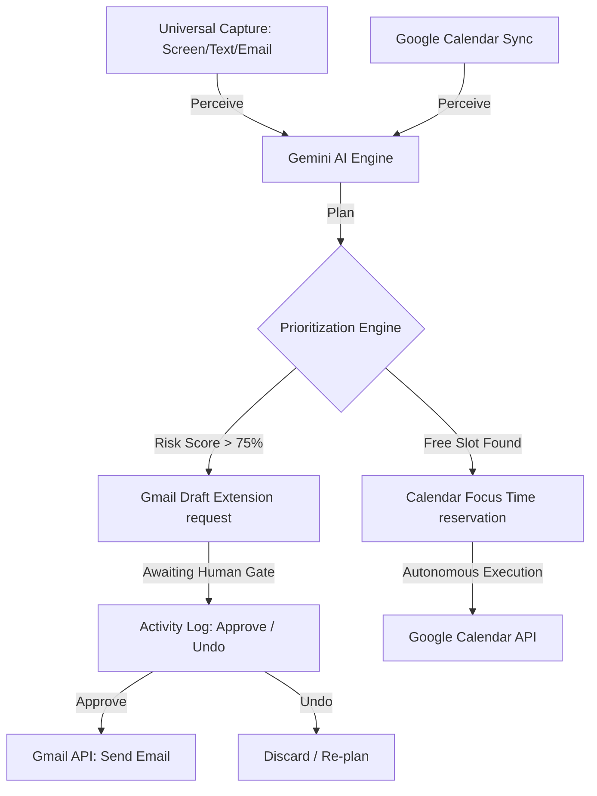

# LastCall — AI Sentinel Command Center
*Vibe2Ship Hackathon — Coding Ninjas 10X Club × Google for Developers*

LastCall is an autonomous AI agent that proactively helps people stop missing deadlines. Instead of sending passive notifications that are easily dismissed, LastCall dynamically plans your focus time on your real Google Calendar and drafts communications (such as extension requests or progress reports) on your behalf, holding them in a human-gated queue for one-tap approval.

---

## 🚀 Key Features

1. **Universal Capture (Perceive)**
   - Drag-and-drop screenshots of chats, notion notes, or emails, or paste raw text. Gemini parses and extracts task title, deadline dates/times, and importance context.
   - Live Gmail scanning detects deadline expressions ("due by", "submit", "action required") and imports them autonomously.
2. **Dynamic Scheduling (Plan)**
   - Reasoning engine reads current calendar blocks and schedules non-overlapping focus time for high-urgency tasks using the Gemini intelligence loop.
   - Computes a global Schedule Risk Index (0-100%) and outputs a step-by-step logic map.
3. **Autonomous Action (Act)**
   - Automatically books focus time slots directly on the user's real Google Calendar.
   - Auto-drafts extension-request emails in Gmail when a deadline is at risk, queuing them for review.
4. **Human Autonomy Boundary (Human-in-the-Loop)**
   - Agent Activity Log acts as the command center. System-internal changes (like calendar scheduling) execute immediately. External actions (like sending emails) are held for one-tap **Approve & Send** or **Discard**.
5. **Context-Aware Re-planning (Reflect)**
   - Re-runs the planning loop on task state changes, manual sync requests, or calendar revisions.

---

## 🛠️ Tech Stack

- **Frontend**: React (Vite) + Tailwind CSS + WebGL custom shader backgrounds.
- **Backend**: Node.js + Express with Google APIs client library.
- **AI Intelligence**: Gemini 1.5 Flash (via `@google/generative-ai` SDK) for structured task parsing and planning.
- **Calendar & Mail APIs**: Google Calendar API & Gmail API integration.
- **OAuth Authentication**: Google OAuth 2.0 with session security.

---

## 📦 Getting Started

### 1. Configure Credentials
Create a `.env` file in the root directory:
```env
PORT=3001
GEMINI_API_KEY=your_gemini_api_key
GOOGLE_CLIENT_ID=your_google_client_id
GOOGLE_CLIENT_SECRET=your_google_client_secret
GOOGLE_REDIRECT_URI=http://localhost:3001/api/auth/callback
SESSION_SECRET=a_random_session_secret_key
NODE_ENV=development
```
*Note: If no Gemini Key or Google Client ID is configured, the application falls back to **Simulator Mode** automatically, letting you demonstrate the entire pipeline with synthetic data.*

### 2. Install & Start Server
```bash
# Install root dependencies
npm install

# Run offline verification checks
node test_agent.js

# Build client assets and launch Express server
npm run build --prefix frontend
npm start
```
Open `http://localhost:3001` in your browser.

---

## 🧬 Architectural Flow


